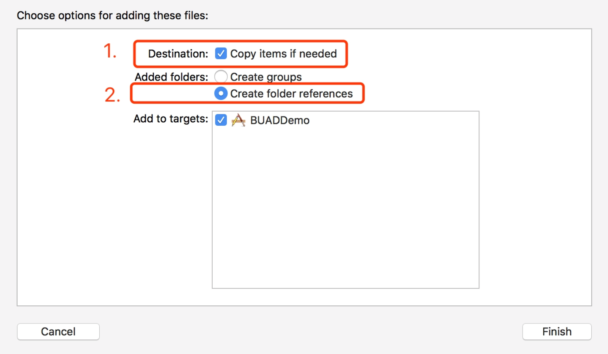
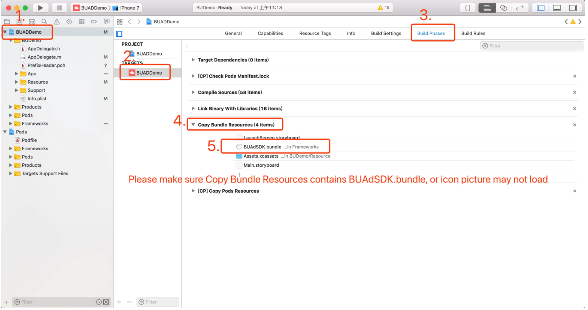
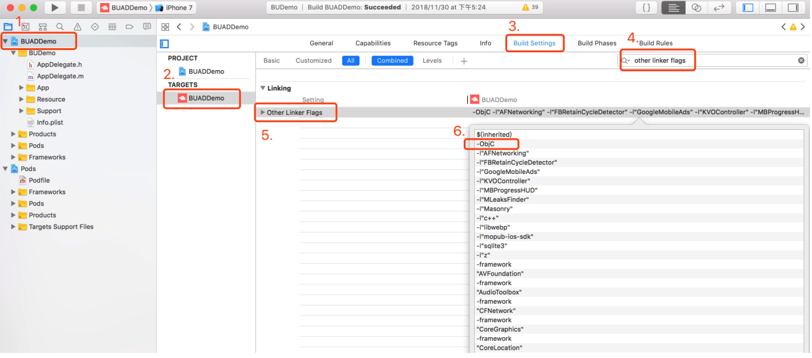
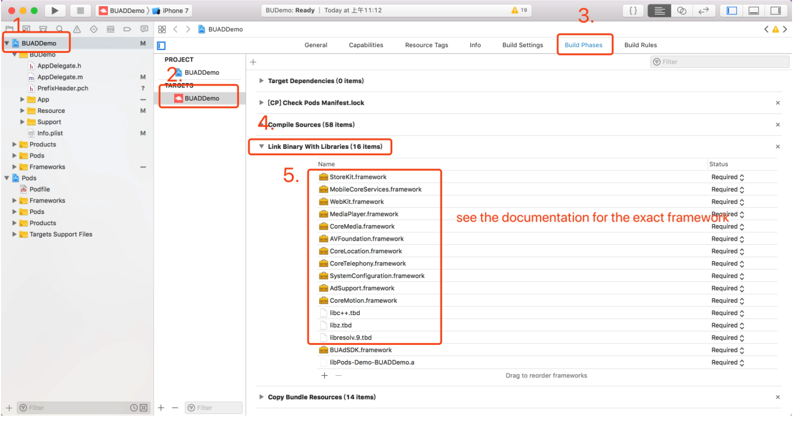
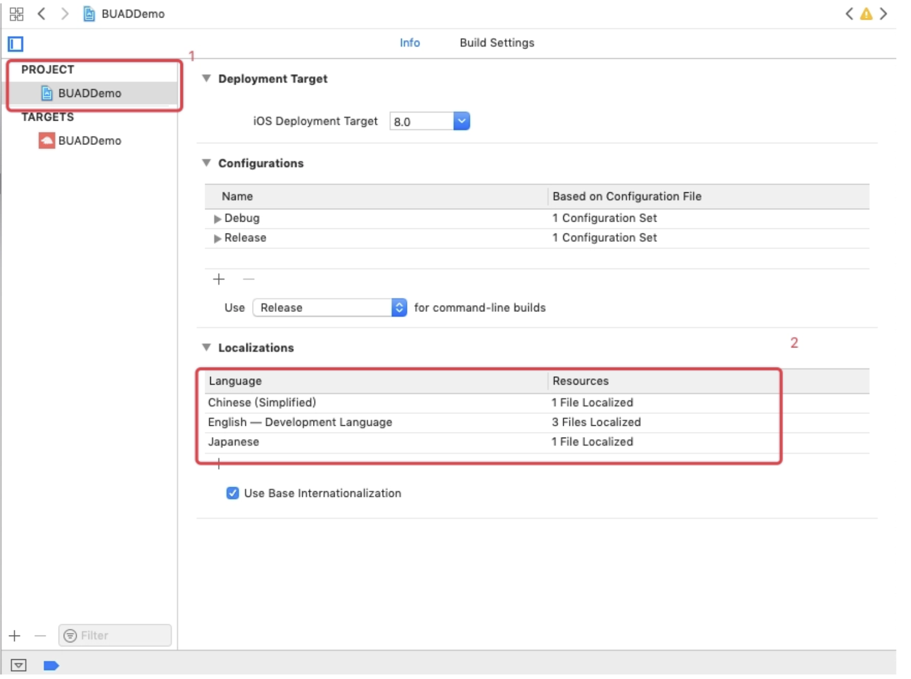

# 1. Import Pangle SDK

## Operating environment requirement
- Support  IOS 9. X and above;
- SDK compilation environment Xcode 11;
- Supporting architecture: x86-64, armv7, arm64,i386

## Method One:
Import {`BUAdSDK.framework`, `BUFoundation.framework`, `BUAdSDK.bundle`, `BUVAAuxiliary.framework`} to the project manually.




**Note: When you upgrade the SDK, you need to update all frameworks and bundle files.**


Please make sure that `Copy Bundle Resource` contains `BUAdSDK.bundle`.




## Xcode Compiler Option Settings

### Add Permissions

Add the parameter `-objc` to `Other Linker Flags` in build settings, and the SDK supports `- all_ load`

#### Detailed Steps:




### Add Dependency Libraries

Project needs to find Link Binary With Libraries in `TARGETS` - > `Build Phases`, click "+", and then add the following dependent libraries in order.

- StoreKit.framework
- MobileCoreServices.framework
- WebKit.framework
- MediaPlayer.framework
- CoreMedia.framework
- AVFoundation.framework
- CoreTelephony.framework
- SystemConfiguration.framework
- AdSupport.framework
- CoreMotion.framework
- Accelerate.framework
- libresolv.9.tbd
- libc++.tbd
- libz.tbd
- libsqlite3.tbd
- libbz2.tbd
- libxml2.tbd
- libiconv.tbd
- Security.framework


**Note: Add the `ImageIO.framework` if the above dependency library is still reporting errors.**

Detailed Steps:




### Add language configuration




## Method Two:
```XML
pod 'Ads-Global', '~>3.4.1.1' 
```

